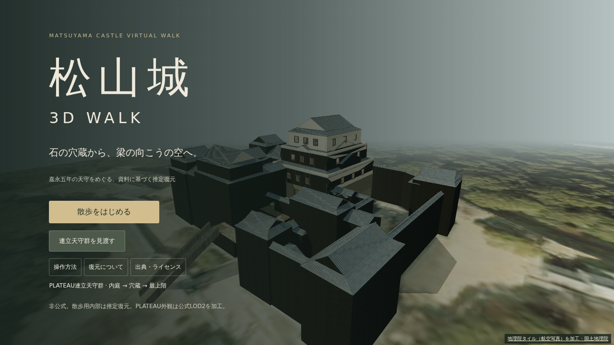
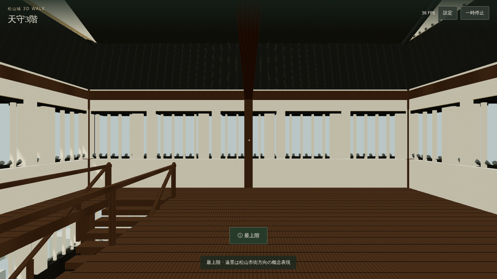

# 松山城 3D WALK
MATSUYAMA CASTLE VIRTUAL WALK

**開発版・RELEASE PASS未達。Pagesの初期有効化が権限不足で停止しています。** 松山城大天守の構成を公式資料の事実から独自生成し、本丸・内庭・穴蔵・木造各階を一人称で歩く静的Webアプリです。実物の測量モデルではありません。

公開予定先（現時点では未公開）：https://ryotamatsuki.github.io/matsuyamacastle-/

## スクリーンショット
CI成功後に以下へ実描画画像がコミットされます。\n\n\n\n\nChromiumの実描画。ブラウザの追加証跡はCIのbrowser-evidence artifactにあります。

## 操作
PC：WASD、マウス、Shift早歩き、Esc解除。階段は歩いて昇降します。
iPhone/iPad：左スティック＋右ドラッグ。同時操作対応。設定で軽量表示と昼/夕方を切替できます。
本丸中央の石段から内庭、入口を通って穴蔵へ。穴蔵左→1階右→2階左の階段で3階へ進みます。

## 技術
Vite / TypeScript / Three.js。静的メッシュを材質・部位ごとにmergeし、遠景はinstancing。PBR、procedural shader grain、soft shadows、DPR制限。画像テクスチャ・外部フォント・CDNアセットなし。
床・ランプ・壁AABBの共通定義と細分化した移動判定で階段と衝突を処理します。独自の歩行領域による落下防止を備えます。

## 3Dモデルと再生成
成果物：public/models/matsuyama_keep.glb（初回CIで生成しコミット）。
入力：src/data/castleDimensions.mjs。
構築：src/castle.mjs / scripts/build-castle-model.mjs。
```sh
npm ci
npm run model
npm run build
npm run dev
```
初回lockfileはCIが生成・コミットします。それまではローカルで npm install --package-lock-only --ignore-scripts を先に実行してください。
同じlockfile・ソースから、ネットワーク資料を取り直さず再生成できます。

## 復元精度
1間=1.82mは仮定。明示された間単位の基本軸組・武者走り比率を守り、階高・窓・階段・石割・地形はC判定の推定です。
[ACCURACY](docs/ACCURACY.md)参照。写真からのB復元は行っていません。天守群の付属棟はC判定の概念外観、現況展示と正確な地形は未実装です。

## データ・権利
[RIGHTS_AUDIT](docs/RIGHTS_AUDIT.md)、[ATTRIBUTION](ATTRIBUTION.md)、[THIRD_PARTY_NOTICES](THIRD_PARTY_NOTICES.md)、[source manifest](public/data/source_manifest.json)。
松山市公式天守解説は事実だけを参照。市の全ページをオープンデータ扱いしません。PLATEAUの該当リソースの条件未確認につき不採用。Wikimedia個別ファイルも未採用です。
Google、商用書籍、非オープン図面、ブログ・観光写真、権利不明素材、AI画像は使用せず、現代平面図のトレースも行いません。
コード：MIT（LICENSE）。自作モデル・procedural素材：CC BY 4.0（LICENSE-ASSETS.md）。依存ソフトウェアは元のライセンスを維持し、全文を public/data/dependency-notices.txt に収録します。

## 検証
```sh
npm ci
npm test
npm run build
VITE_TEST=1 npm run build
npx playwright install chromium webkit
npm run test:browser
npm run build
```
最後のbuildはテスト用位置変更APIを除く本番ビルドです。詳細・未検証項目は [VALIDATION](docs/VALIDATION.md)。

## GitHub Pages
.github/workflows/deploy.yml がmain pushでlockfile準備、npm ci、モデル生成、ブラウザテスト、生成物コミット、本番ビルド、Pagesデプロイを行います。
base=/matsuyamacastle-/ を設定し、GLBとmanifestは import.meta.env.BASE_URL から参照します。
Pagesの初期有効化がGitHubの権限で拒否される場合はSettings → Pages → GitHub Actionsの有効化が必要です。CIの成功や公開を未確認のまま完成とは表示しません。

## 最終ゲート
[全項目の確認状況](docs/RELEASE_GATE.md)。直近のコード検証は成功、Pages初期有効化はGitHubのintegration権限で拒否されています。設定後には公開URLの実ロード・操作・出典・404も自動検証します。実機Safariと目標FPSは未検証です。
